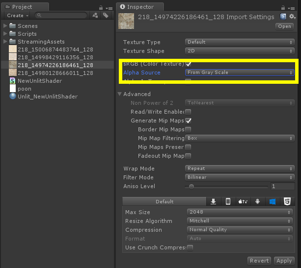
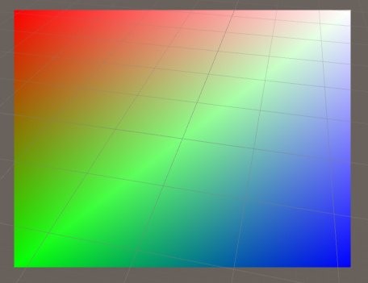

# FelixShader
About Unity Shader :bowtie:

* properties
* material
* lighting
* settexture
* pass

## Shaderlab基本结构

    shader "name"{
        [Properties]
        SubShader   //必需 至少有一个
        [FallBack]    //一般有一个 保证正确显示
    }

在shader主要的三个部分中除了SubShaders有且至少需要一个之外，Properties和FallBack都是可以没有的。但是，如果没有Properties，我们就不能为Shader定制属性，没有FallBack，当任何一个SubShader都无法执行的时候，那么这个着色就会失败，就没有任何的方案去用于显示，所以一般条件下我们不了解我们的Shader是否适应所有的平台硬件时，我们都会使用一个FallBack，保证能够得到基本的正确的显示。

## Fixed function shader

运行速度最快，可以在所有平台上流畅运行

### Pass 表示渲染管线

一个Pass表示一个渲染管线，当存在多个Pass时，即在前一Pass结束后，依据得到的缓存数据和状态开始下一个Pass管线，直到所有Pass管线渲染结束。

### Pass 内开关控制

#### （1）Specularhighlights 反射高光

默认情况下primary颜色是漫反射，阴影色和高光颜色（在光线计算中定义）的加和。如果你将通道设置中的SeparateSpecular On，高光色会在混合计算后被加入，而不是之前。这个命令会添加高光光照到着色器通道的末尾，因此贴图对高光没有影响。只在光照开启时有效。

#### （2）LightingOn

定义材质块中的设定是否有效，你必须使用Lighting On 命令开启光照，而颜色则通过Color命令直接给出。
Lighting On|Off

### Material 信息

Material Block 材质块：
这些是为了设置材质如何影响光照。任何这些属性都能被排除，在这种情况下它们被认为默认为黑色（没起到效果）。

1. 漫反射（Diffuse）：这个是物体最基础的颜色；当光从某一个方向照向球体的时候，球体的一部分是高亮面，一部分是黑暗面。
2. 环境光（Ambient）：当物体被环境光影响时候给物体设置颜色，这个取决于在RenderSettings中设置的环境颜色。
3. 亮度设置（Shininess）：突出清晰度，值在0和1之间。为0时候，你得到1个巨大的高光看起来像很多漫射光照；为1时候，你得到一个小的斑点。
4. 高光反射色（Specular） ：设置物体的高光反射颜色。
5. 自发光色（Emission）：当没被其他光线影响时候，物体本身的自发光颜色。

当物体被所有光线照射时候他的颜色的计算公式如下：

     Ambient * RenderSettings ambient setting +(LightColor * Diffuse + Light Color * Specular) + Emission

 在括号中的那部分光线计算，是计算所有照射到物体上的光线。
通常情况下，你要保持漫反射和环境的颜色相同（所有内建的Unity3dshader 都是这么做的）。

### SetTexture命令

纹理在基本的顶点光照被计算后被应用。在着色器中通过SetTexture 命令来完成。

SetTexture 命令在片面程序被使用时不会生效；这种模式下像素操作被完全描述在着色器中。

材质贴图可以用来做老风格的混合器效果。你能在一个通道中使用多个SetTexture命令 - 所有纹理被顺序的应用，如同绘画程序中的层一样。SetTexture 命令必须放置在通道的末尾。

    SetTexture [TexturePropertyName] { TextureBlock }

分配一个纹理，TextureName必须定义为一个纹理属性。如何应用纹理被定义在TextrueBlock中。

### SetTexture语句块内其他命令

纹理块控制纹理如何被应用。在纹理块中能执行3种命令：合并combine，矩阵matrix和不变色constantColor。

1. combine命令：
    * combine src1 * src2 将源1和源2的元素相乘。结果会比单独输出任何一个都要暗
    * combine src1 + src2将将源1和源2的元素相加。结果会比单独输出任何一个都要亮
    * combine src1 - src2源1 减去 源2
    * combine src1 +- src2先相加，然后减去0.5（添加了一个符号）
    * combine src1 lerp (src2) src3使用源2的透明度通道值在源3和源1中进行差值，注意差值是反向的：当透明度值是1是使用源1，透明度为0时使用源3
    * combine src1 * src2 + src3源1和源2的透明度相乘，然后加上源3
    * combine src1 * src2 +- src3源1和源2的透明度相乘，然后和源3做符号加
    * combine src1 * src2 - src3源1和源2的透明度相乘，然后和源3相减
2. constantColor纹理块命令  
    ConstantColor color  定义在combine命令中能被使用的不变颜色
3. matrix纹理块命令  
    matrix [MatrixPropertyName] 使用给定矩阵变换纹理坐标  
4. SeparateAlpha & Color computation 分离的透明度和颜色混合  
    缺省情况下，混合公式被同时用于计算纹理的RGB通道和透明度。同时，你也能指定只针对透明度进行计算，如下：

        SetTexture [_MainTex] { combine previous *texture, previous + texture } 

如上所述，我们对RGB的颜色做乘然后对透明度相加

**所有源属性都可以是previous, constant, primary or texture其中的一个**

- Previous 上一次SetTexture的结果
- Primary 来自光照计算的颜色或是当它绑定时的顶点颜色
- Texture 在SetTexture中被定义的纹理的颜色
- Constant 被ConstantColor定义的颜色

### Examples

😎创建Fixed function shader：
Assets > Create > Shader > Unlit Shader

    Shader "Custom/Demo"{
        Properties {
             _Color ("Main Color", Color) = (1,1,1,1)
            // 镜面反射颜色 //
            _SpecColor ("Spec Color", Color) = (1,1,1,1)
             // 自发光颜色 //
             _Emission ("Emmisive Color", Color) = (0,0,0,0)
            // 亮度设置 //
            _Shininess ("Shininess", Range(0.01, 1)) = 0.7
            // 材质贴图 //
            _MainText("Base (RGB)", 2D) = "white" {}
            //第二材质贴图//
            _SecondTex("SecondTex",2D) = "white"{}
        }

        SubShader{
            //渲染队列设置 控制渲染顺序
            Tags { "Queue" = "Transparent" }

            Pass{
                //color(1,0,0,1)  //小括号表示赋值
                //color[_Color]  //中括号表示传入可变参数

                Blend SrcAlpha OneMinusSrcAlpha     // Traditional transparency 混合方式

                // 渲染通道的列表，材质块 //
                 Material{
                    Diffuse [_Color]
                    Ambient [_Color]
                    Shininess [_Shininess]
                    Specular [_SpecColor]
                    Emission [_Emission]
                   //Shininess Specular Emission 一起设置 否则Unity2017编译时会卡死 无法运行
                }

                Lighting On|Off
                SeparateSpecular On|Off

                SetTexture [_MainText]{
                    // 混合              顶点光照结果   双倍/四倍
                    Combine texture * primary double/quad
                }

                SetTexture [ _SecondTex]{
                    //Combine texture * primary     会覆盖 _MainText
                    constantColor [_Color]      //混合颜色
                    //prvious为之前计算的结果                取texture的通道信息
                    Combine texture * previous  double,  texture   //单独用texture时 图片Alpha Source 要设置为From Gray Scale（如图）
                    //Combine texture * previous  double,  texture * constantColor [_Color]   //可通过调节_Color的Alpha来调节透明度
                }

            }
        }
    }

## Surface Shaders

SurfaceShader是对VertexShader和FragmentShader的包装，不需要编写Pass通道。如果添加Pass，则编译就会报错。

Unity5.0之前的SurfaceShaderDemo：

    Shader "FelixBang/NewSurfaceShader" {
        Properties {
            _MainTex ("Albedo (RGB)", 2D) = "white" {}
        }
        SubShader {
            Tags { "RenderType"="Opaque"  "Queue" = "Transparent"} //渲染类型 不透明
            LOD 200  //层级

            CGPROGRAM  //开始CG语法
            //按照Surface  函数名 光照模型 阴影设置
            //#pragma surface surf Lambert fullforwardshadows alpha
            #pragma surface surf Lambert alpha
		
            //硬件基础 默认shader model 2.0
            #pragma target 3.0 

            sampler2D _MainTex;

            struct Input {
                float2 uv_MainTex;  //必须uv开头
            };

            void surf (Input IN, inout SurfaceOutput o) {
                // Albedo comes from a texture tinted by color
                fixed4 c = tex2D (_MainTex, IN.uv_MainTex);
                o.Albedo = c.rgb;
                o.Alpha = c.a;
            }
            ENDCG
	    }
	    //FallBack "Diffuse"   //显示透明注释掉，同样当编译后的Shader无法显示 可以添加FallBack
    }

unity5.0以后的SurfaceShader采用了新的标准，输出时多了金属质感：

    Shader "Custom/NewSurfaceShader 1" {
        Properties {
            _Color ("Color", Color) = (1,1,1,1)
            _MainTex ("Albedo (RGB)", 2D) = "white" {}
            _Glossiness ("Smoothness", Range(0,1)) = 0.5
            _Metallic ("Metallic", Range(0,1)) = 0.0
        }
        SubShader {
            Tags { "RenderType"="Opaque" }
            LOD 200

            CGPROGRAM
            #pragma surface surf Standard fullforwardshadows

            #pragma target 3.0

            sampler2D _MainTex;

            struct Input {
                float2 uv_MainTex;
            };

            half _Glossiness;
            half _Metallic;
            fixed4 _Color;

            void surf (Input IN, inout SurfaceOutputStandard o) {
                fixed4 c = tex2D (_MainTex, IN.uv_MainTex) * _Color;
                o.Albedo = c.rgb;
                // Metallic and smoothness come from slider variables
                o.Metallic = _Metallic;
                o.Smoothness = _Glossiness;
                o.Alpha = c.a;
            }
            ENDCG
        }
        FallBack "Diffuse"
    }

## Shader CG入门 

参考内容来自[凯尔八阿哥专栏](http://blog.csdn.net/zhangxiao13627093203/article/details/52850518)

### 输入输出和基本语义

    Shader "FelixBang/VFShader"
    {
        SubShader
        {
            Pass{
                CGPROGRAM //开始
                //两个函数必须都指定否则程序无法执行
                //指定程序类型 函数名
                #pragma vertex vert      //顶点函数
                #pragma fragment frag    //片段函数

                //对顶点进行一系列处理包括几何变换 并将需要的数据传递给片段程序
                //顶点程序必须有POSITIONC
                //语义关键字必须为全大写字母组成（objpos:POSITION 语义：objpos表示一个位置向量），语义只是代表一种运行环境 
                //语义类型： POSITION, NORMAL, BINORMAL, BLENDINDICES, BLENDWEIGHT, TANGENT, PSIZE, TEXCOORD0 ~ TEXCOORD7
                //     输入:in                      输出：out
                void vert(in float2 objPos:POSITION,out float4 pos:POSITION){
                    pos=float4(objPos,0,1);
                }
		     
                //拿到顶点程序处理的数据 进一步计算
                //片段程序不会直接使用POSITION 会由程序直接处理
                void frag(out float4 col:COLOR){
                    col = float4(1,0,0,1);
                }

                //------------------------- 错误 --------------------------------------------------------------------------------------------
                //void vert(in float2 objPos:POSITION,out float4 pos:POSITION,out float4 col:COLOR){
                    //pos=float4(objPos ,0,1);
                    //col=pos;   //这里测试失败
                //}

                //输入输出inout：表示可以把输入直接当成输出返回（顶点颜色输出col当成片段程序的输入，根据类型来匹配的，而不是根据名字来匹配的）
                //void frag(inout float4 col:COLOR){
                //这里测试失败，不能正常输出；原因是vert输出传入frag的是pos,而不是col  	
                //col = float4(1,0,0,1);  
                //}
                //------------------------- 错误 --------------------------------------------------------------------------------------------

                //------------------------- 用顶点的输出col 正确方式方式 --------------------------------------------------------------------------------------------
                //float4 vert(in float2 objPos:POSITION,out float4 pos:POSITION):COLOR{
                    //pos=float4(objPos ,0,1);
                    //float4 col=pos;  //测试失败
                    //return col;
                //}
                //void frag(inout float4 col:COLOR){}
                //------------------------- 用顶点的输出col 正确方式方式 --------------------------------------------------------------------------------------------
                //结束
                ENDCG
            }
        }
    }

参考: [CG入门01](http://blog.csdn.net/aa4790139/article/details/50963097)  

### [Cg profile和基本数据类型](https://www.cnblogs.com/maple-share/p/5545552.html)

#### 基本数据类型

#### profile

如果颜色值的分量都用fixed类型，那么每个颜色值分量都有256种，这个就是目前概念中的真彩色。因此在Unity中，fixed的精度已经足够表示颜色值了。

### CG入门03

向量/Swizzle操作/矩阵/数组/结构体

    Shader "MyShaders/VFShader"
    {
        SubShader
        {
            Pass
            {
                CGPROGRAM

                #pragma vertex vert
                #pragma fragment frag
                #define MACROFL FL4(fl4.ab,fl2.yx);  //定义宏
               
                typedef float4 FL4;   //为某一类型指定类型别名
               
                //结构体
                //struct v2f
                //{
                    //float4 pos;
                    //float2 uv;
                //}
               	
                float4 vert (in float2 objPos:POSITION,out float4 pos:POSITION):COLOR
                {
                   pos=float4(objPos,0,1);
                   float4 col = pos;
                   return col;
                }
			
               void frag (inout float4 col:COLOR)
               {	
                    float2 fl2=float2(1,0);
                    float3 fl3=float3(1,1,0);
                    float4 fl4=float4(1,0,1,1);
                    
                    //知识点：Swizzle操作
                    //float4 f1= float4(fl3.xy,fl4.x,fl4.z);    //  rgba/xyzw
                    
                    //知识点：类型别名
                    //FL4 f1=FL4(fl4.ab,fl2.yx);  
                    
                    //知识点：宏定义后有“;” 这里就不用了
                    //FL4 f1= MACROFL   //
                    
                    //知识点：矩阵
                    //float2x2 M2x2={1,0,1,1};          //这里的乘号为字母“x”
                    //float2x4 M2x4={{1,0,1,1},{0,1,0,1}};
                    //float2x4 M2x4={1,0,1,1,0,1,0,1};
                    //float2x4 M2x4={fl4,{0,1,0,1}};
                    //float4 f1=M2x4[0];
                    
                    //知识点：数组
                    float arr[4]={1,0.5,0.5,1};
                    //col=arr;  //不允许 报错
                    float4 f1= float4(arr[0],arr[1],arr[2],arr[3]);
                    
                    //知识点：结构体
                    //v2f o;
                    //o.pos=fl4;
                    //o.uv=fl2;
                    
                    bool b1=false;
                    col= b1? float4(1,1,1,1):f1;
               }
               ENDCG
            }
        }
    }

### CG入门04：流程控制

    Shader "MyShaders/CG04"
    {
        SubShader
        {
            Pass
            {
                CGPROGRAM

                #pragma vertex vert
                #pragma fragment frag
			
                float4 vert (in float2 objPos:POSITION,out float4 pos:POSITION):COLOR
                {
                    pos=float4(objPos,0,1);
                    float4 col;
                    //---------- if...else...语句
                    if(pos.x<0 && pos.y<0)
                        col=float4(1,0,0,1);
                    else if(pos.x<0)
                        col=float4(0,1,0,1);
                    else if(pos.y>0)
                        col=float4(0,0,1,1);
                    else
                        col=float4(1,1,1,1);
                    //顶点处理之后的光栅化片段级着色使用自动渐变过度，效果如图：
                    // if...else...语句 -----------
                    return col;
                }
			
                void frag (inout float4 col:COLOR)
                {	
                    //---------- 2017版对switch语句支持良好
                    //int i=4;
                    //switch(i)
                    //{
                        //case 0:
                        //col = float4(1,0,0,1);
                        //break;
                        //case 1:
                        //col = float4(0,1,0,1);
                        //break;
                        //case 2:
                        //col = float4(0,0,1,1);
                        //break;
                        //default:
                        //col = float4(1,1,1,1);
                        //break;
                    //}
                    // 2017版对switch语句支持良好 ----------- 

                    //---------- while 循环
                    //int i=0;
                    //while(i<10){
                        //i++;
                    //}
                    //if(i==10)
                        //col = float4(1,1,1,1);
                    // while 循环 ---------

                    //---------- do...while 循环
                    //int i=0;
                    //do{
                        //i++;
                    //}//while(i<10);

                    //if(i==10)
                        //col = float4(1,0.5,1,1);
                    //  do...while 循环 ---------
				
                    //---------- for 循环
                    for(int i=0;i<10;i++){ }

                    if(i==10)
                        col = float4(1,0.5,0.5,1);
                    // for 循环 ---------
                    //注意：while、Do-while、for ：循环上线为1024，只能循环1023此
                }
                ENDCG
            }
        }
    }

CG入门04：流程控制

### CG入门05：函数

    Shader "MyShaders/CG05"
    {   
	    SubShader
	    {
		    Pass
		    {
			    CGPROGRAM
			    #pragma vertex vert
			    #pragma fragment frag
		
			    void Func(out float4 c);  //前向声明 若没有声明，Func必须放在调用函数之前，否则会报错：undeclared identifier 'Func' at line
			    float Func2(float arr[2])
			    {
				    float sum=0;
				    for(int i =0;i<arr.Length;i++)	
					    sum+=arr[i];
				    return sum;
			    }
				
			    float4 vert (in float2 objPos:POSITION,out float4 pos:POSITION):COLOR
			    {
				    pos=float4(objPos,0,1);
				    float4 col = pos;
				    return col;
			    }

			    void frag (inout float4 col:COLOR)
			    {	
				    //Func(col);
				    float arr[2]={0.5,0.5};  //必须指定维度
				    col.x=Func2(arr);
			    }

			    void Func(out float4 c)
			    {
				    c=float4(0,1,0.5,1);
			    }
			    ENDCG
		    }
	    }
    }

include方法

创建一个sbin.cginc(自定义的该文件放在Shader相同目录下：Program Files\Unity\Editor\Data\CGIncludes\Sbin)

    inline float Func2(float arr[2])
	{
		float sum=0;
		for(int i =0;i<arr.Length;i++)
		{	
			sum+=arr[i];
		}
		return sum;
	}
	
	inline void Func(out float4 c)
	{
		c=float4(0,1,0.5,1);
	}

引用：

    Shader "MyShaders/CG05"
    {
	    SubShader
	    {
		    Pass
		    {
			    CGPROGRAM
			    #pragma vertex vert
			    #pragma fragment frag
		
			    #include "sbin.cginc"
			    	
			    float4 vert (in float2 objPos:POSITION,out float4 pos:POSITION):COLOR
			    {
				    pos=float4(objPos,0,1);
				    float4 col = pos;
				    return col;
			    }

			    void frag (inout float4 col:COLOR)
			    {	
				    float arr[2]={0.1,0.5};  //必须指定维度
				    col.y=Func2(arr);
			    }
    			ENDCG
		    }
	    }
    }

### CG入门06：内建函数

[CG标准函数库](http://blog.csdn.net/jingmengshenaaa/article/details/52809879)

### 3D数学基础1：坐标系

#### 模型坐标系
1. 2D模型坐标系

2. 2D中的世界坐标系 

#### 世界坐标系

#### 摄像机坐标系

#### 屏幕投影坐标系

## 光照

物体的法向量为物体的本身，而光照则为Unity世界坐标。
可以将物体从自身坐标转到世界坐标后，再根据公式实时计算法向量。

